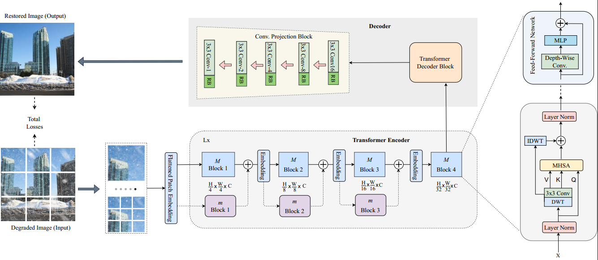

# WiT Network

<a href="https://ieeexplore.ieee.org/document/10246273"> </a>

This is the implementation code for the paper *titled:* [Restoring Snow-Degraded Single Images With Wavelet in Vision Transformer](https://ieeexplore.ieee.org/document/10246273), IEEE Access 2023.

<p align="left">
  
</p>

# Executive Summary:

Images corrupted by snowy adverse weather can impose performance impediments to critical high-level vision-based applications. Restoring snow-degraded images is vital, but the task is ill-posed and very challenging due to the veiling effect, stochastic distribution, and multi-scale characteristics of snow in a scene. In this regard, many existing image denoising methods are often less successful with respect to snow removal, being that they mostly achieve success with one snow dataset and underperform in others, thus questioning their robustness in tackling real-world complex snowfall scenarios. In this paper, we propose the wavelet in transformer (WiT) network to address the image desnow inverse problem. Our model exploits the joint systemic capabilities of the vision transformer and the renowned discrete wavelet transform to achieve effective restoration of snow-degraded images. In our experiments, we evaluated the performance of our model on the popular SRRS, SNOW100K, and CSD datasets, respectively. The efficacy of our learning-based network is proven by our obtained numeric and qualitative result outcomes indicating significant performance gains compared to image desnow benchmark models and other state-of-the-art methods in the literature.

# How to Run the Code:

- Recommended Python versions is 3.7.7 to 3.8, and CUDA versions 10.2 to 11.0

- Download or Clone this repo

```
git clone https://github.com/WINS-lab/WiT
cd WiT
```

- Install package dependencies using 'pip3 install -r requirements.txt'
